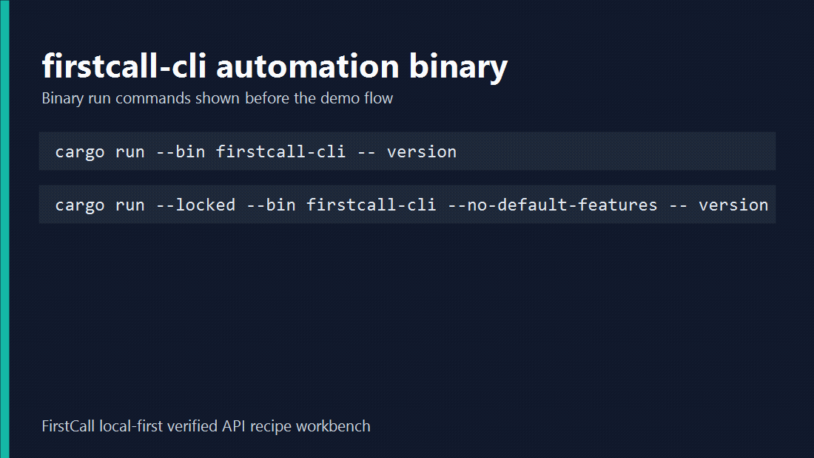
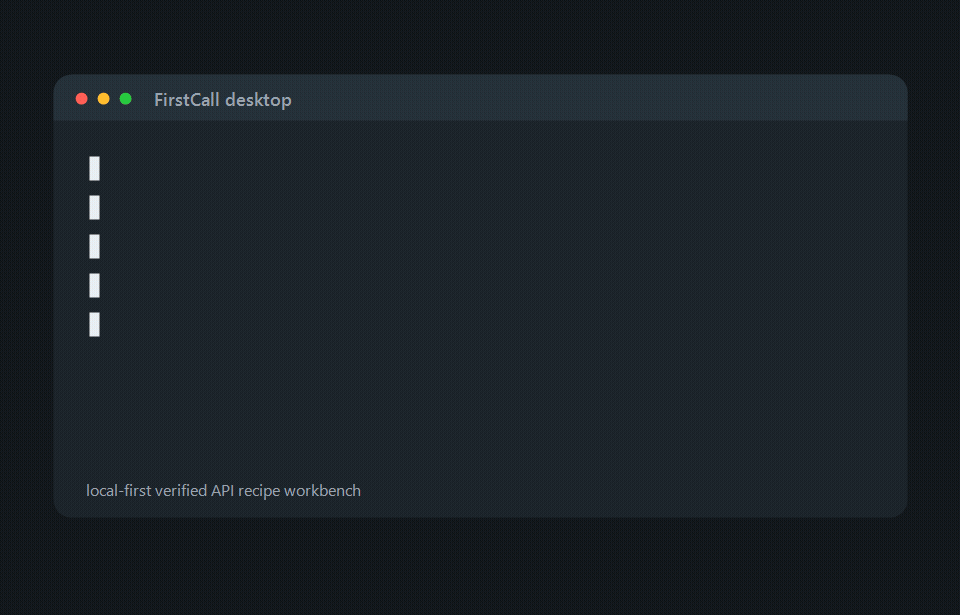

<div align="center">

```
███████╗██╗██████╗ ███████╗████████╗ ██████╗ █████╗ ██╗     ██╗
██╔════╝██║██╔══██╗██╔════╝╚══██╔══╝██╔════╝██╔══██╗██║     ██║
█████╗  ██║██████╔╝███████╗   ██║   ██║     ███████║██║     ██║
██╔══╝  ██║██╔══██╗╚════██║   ██║   ██║     ██╔══██║██║     ██║
     ██║     ██║██║  ██║███████║   ██║   ╚██████╗██║  ██║███████╗███████╗
     ╚═╝     ╚═╝╚═╝  ╚═╝╚══════╝   ╚═╝   ╚══════╝╚═╝  ╚═╝╚══════╝╚══════╝
```

**Local-first Rust workbench that turns raw API requests into verified, redacted, agent-ready tool packages.**

[](https://github.com/rad1092/firstcall-local-api-workbench/actions/workflows/ci.yml)
[](https://github.com/rad1092/firstcall-local-api-workbench/actions/workflows/cli-lifecycle.yml)
[](https://github.com/rad1092/firstcall-local-api-workbench/actions/workflows/loopback-verify.yml)
[](https://github.com/rad1092/firstcall-local-api-workbench/actions/workflows/security.yml)
[](LICENSE)

</div>

FirstCall is a local-first Rust workbench for turning API request sources into verified, redacted, agent-ready recipe packages. Its useful part is the trust chain: parse a request, verify it locally, export a package, inspect/import it, then re-verify before storage-backed re-export. Every exported package ships a runnable MCP server, so a recipe becomes a callable agent tool.





## Download

Download the archive for your OS from [GitHub Releases](https://github.com/rad1092/firstcall-local-api-workbench/releases), extract it, then run:

```powershell
firstcall --screen new --sample curl
firstcall-cli version
firstcall-cli --help
```

Each release archive includes:

- `firstcall`: desktop GUI workbench.
- `firstcall-cli`: automation CLI for agents, CI, and scripts.

The desktop GUI can be started against an isolated store for repeatable demos or validation:

```powershell
firstcall --data-dir ./tmp/firstcall-data --config-dir ./tmp/firstcall-config --screen recipes
```

## Quick Start

```powershell
cargo run --locked --bin firstcall-cli -- package --recipe-json fixtures/verified-agent-recipe.json --out ./tmp/demo-pkg
cargo run --locked --bin firstcall-cli -- validate-package --dir ./tmp/demo-pkg --json
cargo run --locked --bin firstcall-cli -- inspect-package --dir ./tmp/demo-pkg --json
```

Generated packages include `recipe.yaml`, `verified.lock.json`, `policy.json`, `skill.md`, `package.manifest.json`, and a TypeScript `mcp-server/` with an npm lockfile. Runtime MCP confidence is checked separately with `npm ci --ignore-scripts`, a TypeScript build, MCP tool discovery, and a real generated-tool call.

## Safety

- Secrets are represented as environment variables and are not intentionally written to SQLite, package files, CLI reports, logs, or demo assets.
- Package validation checks schema, policy, manifest hashes, generated MCP markers, and obvious secret leaks; import-readiness also recomputes verified lock fingerprints against `recipe.yaml`.
- Local verification and generated MCP execution do not follow redirects and cap response bodies at 1 MiB before previewing them.
- Local verification disables system/environment proxies, validates the complete DNS answer set off the reqwest runtime thread, and pins the first successful set for the secure client's lifetime. Rebuilding the client refreshes the pin; failed lookups remain fail-closed but can be retried.
- Generated MCP servers load package-root `policy.json` at startup and fail closed on malformed or inconsistent policy. They enforce the exported method, exact origin, path template, blocked routing/override headers, a 30-second timeout, response limit, and mutation confirmation at runtime.
- The generated Node runtime validates the complete first DNS answer set, pins it for the MCP process lifetime, and connects directly to one validated address while preserving the original Host header and TLS SNI. It does not consume proxy environment variables; restart the process to refresh DNS or recover from a cached rejected lookup.
- Preserved response schemas are sanitized before storage/export and are validated again by both CLI verification and the generated MCP runtime; truncated or schema-invalid HTTP 2xx responses are not reported as successful tool results.
- Imported packages are marked as requiring local re-verification before `package --recipe-id` can export them again.
- Static adapters do not execute imported scripts, tests, hooks, captures, assertions, or environment files.

## Docs

- [CLI lifecycle](docs/cli-lifecycle.md)
- [Agent package schema](docs/agent-package-schema.md)
- [Release readiness](docs/release-readiness.md)
- [Product surfaces](docs/surfaces.md)
- [Architecture](docs/architecture.md)
- [Support boundaries](docs/support-boundaries.md)
- [Contributing](CONTRIBUTING.md)


